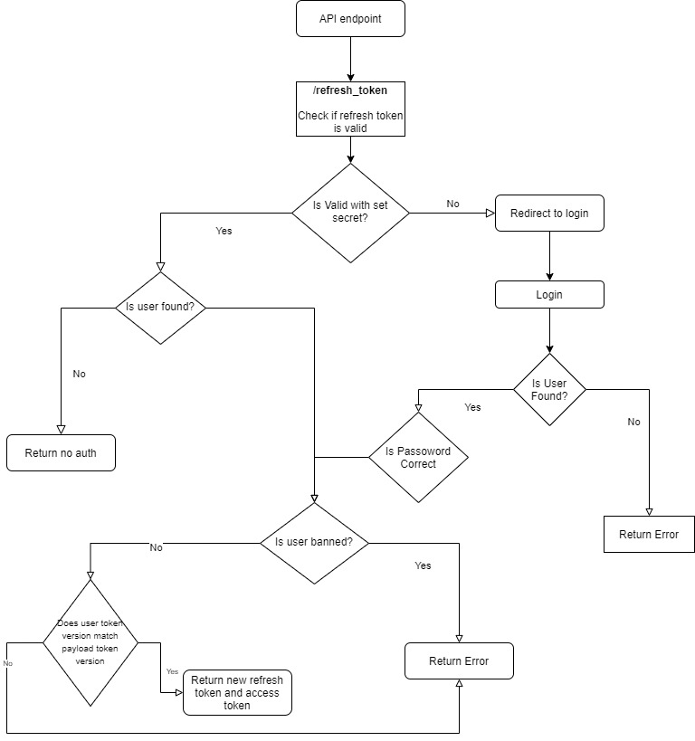

### Fill in .env (make sure to check client and server folders to fill in all .env && .env-cmdrc)

REDIS_PASSWORD=

### Start here

`npm run dev` to start project.
Make sure to run `npm i` in this root, client and server folder

Make sure to create a postgres db associated with the same name as the database listed in the ormconfig.json file which you created in the server folder

Make sure to add all env neccesary

postgres.env (This is for docker db container)

### SOME API ROUTE Design



### Docker-Compose

Add password for redis in .env (see .env.example)

Rebuild compose

For dev build make sure to allocate more resources to client server in docker compose

sometimes when starting dev after prod I run into this error (docker allocation failure gc in old space requested)
To fix it I just delete any restrictions and volumes from docker-compose and it fix's the problem

**REMOVE:**

```
volumes:
    - /app/node_modules
    - ./client:/app
mem_limit: 2048M
mem_reservation: 256M
cpus: 0.5
```

#### Stop down the services

docker-compose stop

#### Remove the previously created docker resources

docker-compose rm

_remove images in linux_

sudo docker rmi -f $(sudo docker images -a -q)

_remove images in windows_

docker rm -f $(docker ps -a -q)

_remove volumes_

docker volume rm $(docker volume ls -q)

#### Delete specific volume

sudo docker volume rm flix_postgres_data

#### For Docker compose running old images do

docker-compose down

docker-compose build

docker-compose up

#### Bring up the services again (Can do this when not wanting downtime but also updating containers)

docker-compose up --build

#### Prune docker image and volume

docker image prune

docker volume prune

#### View docker Stats

docker stats

#### Docker remove extra data (do this when images are running)

docker system prune

docker image prune

docker volume prune

docker builder prune (prunes build cache)

docker system df will also tell you how much space the local volumes are taking

#### Resources

[Cloudflare Setup](https://www.youtube.com/watch?v=cI17WMKtntA&t=203s)
