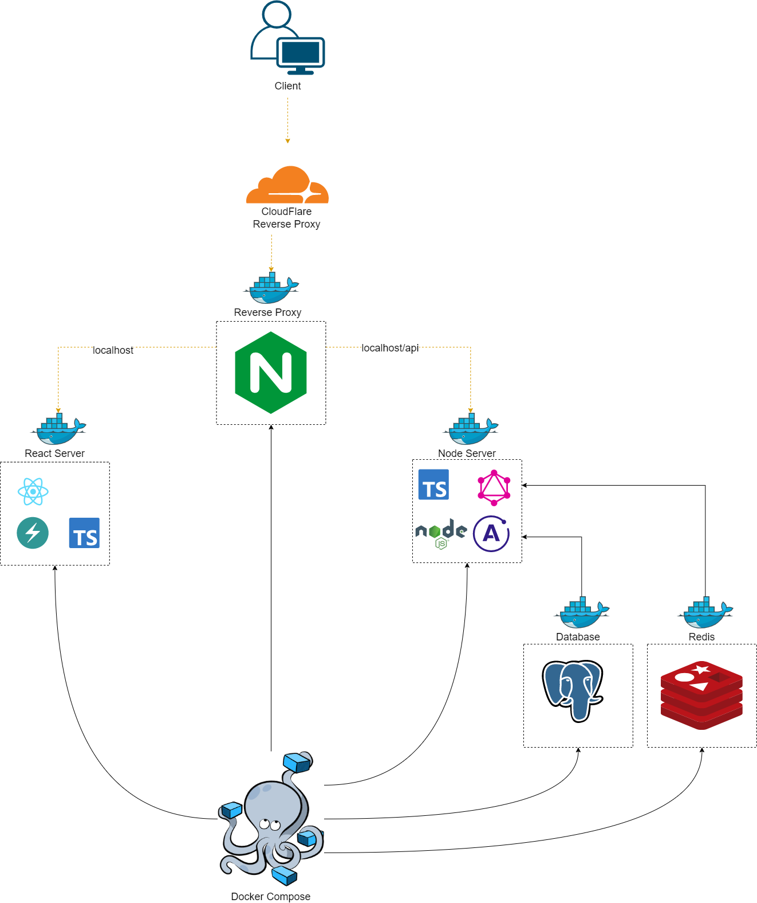

# Flix

Fullstack web application to search and view media information

## Demo


### System Design (Click image for better quality)



### Run on Local host or Docker

**_Fill in .env (make sure to check client and server folders to fill in all .env)_**

Update postgres.env hostname to docker container name (db) or localhost to run locally

Update redis.env Host to be docker container name (redis) or localhost to run locally

For docker update the nginx config with the correct IP or Website name

Update links in frontend env to point to the proper GQL and Auth links

**Nginx**

In the nginx folder update "websitename.com" to your site name where you will be accessing it by

### Start here

`npm run dev` to start project.
Make sure to run `npm i` in this root, client and server folder

Make sure to create a postgres db associated with the same name as the database listed in the ormconfig.json file which you created in the server folder

Make sure to add all env neccesary

postgres.env (This is for docker db container)

### Auth API ROUTE Design


### Docker-Compose

Add password for redis in .env (see .env.example)

Rebuild compose

For dev build make sure to allocate more resources to client server in docker compose

sometimes when starting dev after prod I run into this error (docker allocation failure gc in old space requested)
To fix it I just delete any restrictions and volumes from docker-compose and it fix's the problem

**REMOVE:**

```
volumes:
    - /app/node_modules
    - ./client:/app
mem_limit: 2048M
mem_reservation: 256M
cpus: 0.5
```

#### Stop down the services

docker-compose stop

#### Remove the previously created docker resources

docker-compose rm

_remove images in linux_

sudo docker rmi -f $(sudo docker images -a -q)

_remove images in windows_

docker rm -f $(docker ps -a -q)

_remove volumes_

docker volume rm $(docker volume ls -q)

#### Delete specific volume

sudo docker volume rm flix_postgres_data

#### For Docker compose running old images do

docker-compose down

docker-compose build

docker-compose up

#### Bring up the services again (Can do this when not wanting downtime but also updating containers)

docker-compose up --build

## Running Docker without building frontend (Takes the longest)

Navigate to Dockerfile in client folder and comment out

sometimes if ur node_modules is already installed you dont need to do npm i (thats what takes the longest)

`RUN npm i`

`RUN npm run build`

prevents the frontend from installing packages and running build with are very timely and not needed if no changes were apples. This process is very intense and can crash our server sometimes

#### Prune docker image and volume

docker image prune

docker volume prune

#### View docker Stats

docker stats

#### Docker remove extra data (do this when images are running)

docker system prune

docker image prune

docker volume prune

docker builder prune (prunes build cache)

docker system df (will also tell you how much space the local volumes are taking)

## Cloudflare Setup

**Once site is running with a domian make sure you have a DNS record with www, for example**	

- A record
- Host name www
- Data / Value (Server IP)

to do this you can sign into cloudflare, navigate to DNS and add it in the "DNS management for" section

if www still doesnt work, with cloudflare you can go to Rules -> Page Rules and add a rule to redirect all www requests

Now you should have access to www.catchatrailer.com

**To set up with cloudflare CDN and HTTPS add your app url to cloudflare**

Add cloudflares name server to your domian host (google domians) in custom name servers section

On the side bar select SSL/TLS

Select Edge Certificates

Toggle "Always Use HTTPS"


