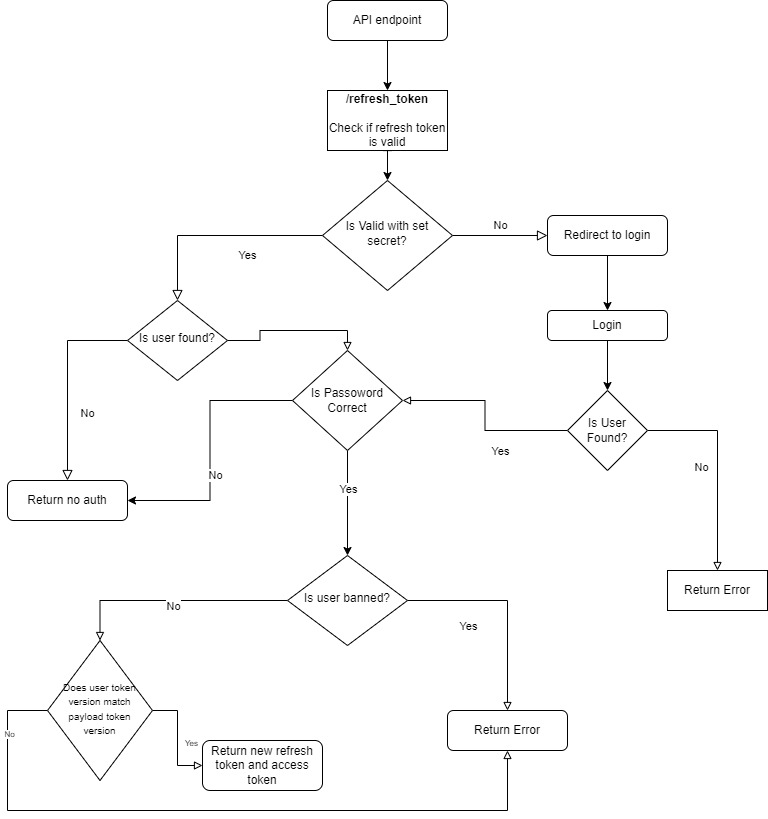

### Start here

`npm run dev` to start project.
Make sure to run `npm i` in this root, client and server folder

Make sure to create a postgres db associated with the same name as the database listed in the ormconfig.json file which you created in the server folder

Make sure to add all env neccesary

### SOME API ROUTE Design



### Docker-Compose

Rebuild compose

For dev build make sure to allocate more resources to client server in docker compose

sometimes when starting dev after prod I run into this error (docker allocation failure gc in old space requested)
To fix it I just delete any restrictions and volumes from docker-compose and it fix's the problem

**REMOVE:**

```
volumes:
    - /app/node_modules
    - ./client:/app
mem_limit: 2048M
mem_reservation: 256M
cpus: 0.5
```

#### Stop down the services

docker-compose stop

#### Remove the previously created docker resources

docker-compose rm

_remove images in linux_
sudo docker rmi -f $(sudo docker images -a -q)

_remove images in windows_
docker rm -f $(docker ps -a -q)

#### For Docker compose running old images do

docker-compose down

docker-compose build

docker-compose up

#### Bring up the services again

docker-compose up --build
